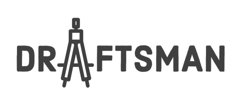

<p align="center">
  
</p>

# Draftsman

Draftsman is a DSL framework for Swift focused on builder pattern
If you are still using version 2.3.x, Separated README is available [here](https://github.com/hainayanda/Draftsman/blob/master/README_2_3.md).
If you are still using Swift 5.1, please use 1.1.x version. Separated README is available [here](https://github.com/hainayanda/Draftsman/blob/master/README_1_1_1.md).

[](https://www.codacy.com/gh/hainayanda/Draftsman/dashboard?utm_source=github.com&amp;utm_medium=referral&amp;utm_content=hainayanda/Draftsman&amp;utm_campaign=Badge_Grade)


[](https://swift.org/package-manager/)
[](https://cocoapods.org/pods/Draftsman)
[](https://cocoapods.org/pods/Draftsman)
[](https://cocoapods.org/pods/Draftsman)

***

## Example

To run the example project, clone the repo, and run `pod install` from the Example directory first.

## Requirements

- Swift 5.5 or higher
- iOS 13.0 or higher
- XCode 13 or higher

## Installation

### Cocoapods

Draftsman is available through [CocoaPods](https://cocoapods.org). To install
it, simply add the following line to your Podfile:

```ruby
pod 'Draftsman', '~> 3.2.1'
```

### Swift Package Manager from XCode

- Add it using XCode menu **File > Swift Package > Add Package Dependency**
- Add **<https://github.com/hainayanda/Draftsman.git>** as Swift Package URL
- Set rules at **version**, with **Up to Next Major** option and put **3.2.1** as its version
- Click next and wait

### Swift Package Manager from Package.swift

Add as your target dependency in **Package.swift**

```swift
dependencies: [
    .package(url: "https://github.com/hainayanda/Draftsman.git", .upToNextMajor(from: "3.2.1"))
]
```

Use it in your target as a `Draftsman`

```swift
 .target(
    name: "MyModule",
    dependencies: ["Draftsman"]
)
```

## Author

Nayanda Haberty, hainayanda@outlook.com

## License

Draftsman is available under the MIT license. See the LICENSE file for more info.

***

## Basic Usage

Draftsman is the `NSLayoutConstraints` and `UIView` hierarchy builder. Draftsman uses a new resultBuilder from Swift that makes the Declarative approach possible.

***

### Basic

Creating constraints is very easy. All you need to do is call `drf` to get the `LayoutDraft` object:

```swift
myView.drf
    .left.equal(to: otherView.drf.right)
    .right.equal(with: .parent).offset(by: 16)
    .top.lessThan(with: .safeArea).offSet(8)
    .bottom.moreThan(with: .top(of: .keyboard))
    .apply()
```

there are two methods to end planning constraints which can be called from both any `UIView` or `UIViewController`:

- `func apply() -> [NSLayoutConstraint]`
- `func build() -> [NSLayoutConstraint]`

the difference between the two is `apply` will activate the constraints but `build` will only create constraints without activating them. Apply return value is discardable so it's optional for you to use the created `NSLayoutConstraint` or not.

You could always create a `UIViewController` or `UIView` and implement the `Planned` protocol, and call `applyPlan()` whenever you want the `viewPlan` to be applied:

```swift
import Draftsman

class MyViewController: UIViewController, Planned {
    
    var models: [MyModel] = []
    
    @LayoutPlan
    var viewPlan: ViewPlan {
        VStacked(spacing: 32) { 
            if models.isEmpty {
                MyView()
                MyOtherView()
                SomeOtherView()
            } else {
                for model in models {
                    MyModeledView(model)
                }
            }
        }
        .centered()
        .matchSafeAreaH().offset(by: 16)
        .vertical.moreThan(with: .safeArea).offset(by: 16)
    }
    
    override func viewDidLoad() {
        super.viewDidLoad()
        applyPlan()
    }
}
```

`ViewPlan` can always be composed to make the code cleaner:

```swift
import Draftsman

class MyViewController: UIViewController, Planned {
    
    var models: [MyModel] = []
    
    @LayoutPlan
    var viewPlan: ViewPlan {
        VStacked(spacing: 32) { 
            stackPlan
        }
        .centered()
        .matchSafeAreaH().offset(by: 16)
        .vertical.moreThan(with: .safeArea).offset(by: 16)
    }

    @LayoutPlan
    var stackPlan: ViewPlan {
        if models.isEmpty {
            emptyStackPlan
        } else {
            modeledStackPlan(for: models)
        }
    }

    @LayoutPlan
    var emptyStackPlan: ViewPlan {
        MyView()
        MyOtherView()
        SomeOtherView()
    }

    @LayoutPlan
    func modeledStackPlan(for models: [MyModel]) -> ViewPlan {
        for model in models {
            MyModeledView(model)
        }
    }
    
    override func viewDidLoad() {
        super.viewDidLoad()
        applyPlan()
    }
}
```

Working with UITableView or UICollectionView? Do it easily with Draftsman and Combine:

```swift
import Draftsman
import Combine

class MyViewController: UIViewController, Planned {
    
    @Published var models: [MyModel] = []
    
    @LayoutPlan
    var viewPlan: ViewPlan {
        Tabled(forCell: MyTableCell.self, observing: $models) { cell, model in
            cell.apply(model)
        }
        .fillParent()
    }
    
    override func viewDidLoad() {
        super.viewDidLoad()
        applyPlan()
    }
}
```

### View Hierarchy

You can create a view hierarchy while creating constraints by using the `draftContent` or `drf.insert` method and `insert` method for the subview draft (`draftStackedContent` or `drf.insertStacked` and `insertStacked` if its arranged subviews in `UIStackView`). Don't forget to call `apply()` or `build()`, Both will rearrange the view hierarchy but only `apply()` will activate the constraints created.

```swift
view.draftContent {
    UIView().drf
        .center.equal(to: .parent)
        .horizontal.equal(to: .safeArea)
        .vertical.moreThan(with: .safeArea)
        .insert {
            myView.drf
                .edges(.equal, to: .parent)
        }
}.apply()
```

The hierarchy of Views is just like how the closure is declared in your code.
The above code actually will do the following instruction sequentially:

1. `view` create and insert a new `UIView()`
2. new `UIView` then will create constraints
3. new `UIView` then will insert `myView`
4. `myView` then will create constraints
5. all the constraints then will be created and activated

So if the hierarchy is written in pseudo hierarchy style, it should be similar to this:

```
view
|____new UIView
|    |____myView
```

the compatible type to be passed in the closure are:

- any descendant of `UIView`
- any descendant of `UIViewController`

If you pass `UIViewController`, it will be automatically added the `UIViewController` view as a child and put the `UIViewController` as a child of its current `UIViewController`.
You could insert components as much as you need, it will fit all the Views just like how you write them.

### Using Builder

For most of the time, you can build your view using [Builder](https://github.com/hainayanda/Builder) library built-in in the Draftsman by calling the property name and get back to Draftsman by calling `drf` again:

```swift
myView.drf
    .backgroundColor(.black)
    .drf.bottom.moreThan(to: .safeArea)
    .center.equal(to: .parent)
```

In case the property is not mapped then you can call builder before calling the property name:

```swift
myView.drf.builder
    .backgroundColor(.black)
    .drf.bottom.moreThan(to: .safeArea)
    .center.equal(to: .parent)
```

### Using Combine

For most of the time, you can using Combine Publisher to automatically assign to the property by calling the property name and get back to Draftsman by calling `storeAll(in:)`:

```swift
@Published var myText: String?
@Published var myColor: UIColor?

var cancellables: Set<AnyCancellable> = .init()

...
...

UILabel().drf
    .text(to: $myText)
    .textColor(to: $myColor)
    .storeAll(in: &cancellables)
    .center.equal(to: .parent)
    .bottom.moreThan(to: .safeArea)
```

In case the property is not mapped then you can call subscriber before calling the property name:

```swift
UILabel().drf.subscriber
    .text(to: $myText)
    .textColor(to: $myColor)
    .storeAll(in: &cancellables)
    .center.equal(to: .parent)
    .bottom.moreThan(to: .safeArea)
```

***

### Basic Positioning

Positioning a View is easy. You just need to declare which anchor should have relation to others:

```swift
myView.drf
    .top.equal(to: other.drf.top)
    .right.moreThan(to: other.drf.right).offset(by: 8)
    .bottom.lessThan(to: other.drf.bottom).offset(by: 8).priority(.required)
    .left.equal(to: other.leftAnchor)
    .centerX.moreThan(to: other.centerXAnchor).inset(by: 8)
    .centerY.lessThan(to: other.centerYAnchor).inset(by: 8).identifier("centerY")
```

basic position anchors available from Draftsman are:

- **top**
- **left**
- **bottom**
- **right**
- **centerX**
- **centerY**
- **leading**
- **trailing**

All are available for both `UIView` and `UILayoutGuide`
This can be used to create a constraint using one of these three methods:

- **equal(to:)**
- **moreThan(to:)**
- **lessThan(to:)**

Those methods can accept basic `NSLayoutAnchor` from `UIKit` or use `Anchor` from `Draftsman` as long it's in the same Axis.
To add a constant, use one of the `offset(by:)` or `inset(by:)` methods. offset` is the spacing going to the outer part of the anchor and `inset` are spacing going to the inner part of the anchor:


For center anchor, offset and inset can be described in this picture:


You can then add priority or/and an identifier for the constraints created.

### Basic Dimensioning

Dimensioning a View is easy. You just need to declare which anchor should have relation to others or constant:

```swift
myView.drf
    .height.equal(to: other.drf.width)
    .width.moreThan(to: other.drf.height).added(by: 8)
    .height.lessThan(to: anyOther.heightAnchor).substracted(by: 8).priority(.required)
    .width.equal(to: anyOther.widthAnchor).multiplied(by: 0.75).identifier("width")
```

basic dimension anchors available from Draftsman are:

- **height**
- **width**

All are available for both `UIView` and `UILayoutGuide`
This can be used to create a constraint using one of these three methods:

- **equal(to:)**
- **moreThan(to:)**
- **lessThan(to:)**

Those methods can accept basic `NSLayoutDimension` from `UIKit` or use dimension `Anchor` from `Draftsman`.
To add a constant, use one of the `added(by:)`, `substracted(by:)`, or `multiplied(by: )` methods.
You can then add priority or/and an identifier for the constraints created.

Dimensioning can be achieved using constant too:

```swift
myView.drf
    .height.equal(to: 32)
    .width.moreThan(to: 64)
    .width.lessThan(to: 128).priority(.required).identifier("width")
```

Very similar except it accepts `CGFloat`

### Combining Two or More Anchors

Creating constraints using multiple anchors is very easy, you can always combine two or more anchors and use them to create multiple constraints at once:

```swift
myView.drf
    .top.left.equal(to: other.drf.top.left)
    .bottom.left.right.moreThan(to: anyOther.drf.top.left.right)
```

It will be similar to single anchors, but you can only be passed `Draftsman Anchor` with the same Axis combination:

- all same anchors combination can be related to each other
- **top.left**, **top.right**, **bottom.left**, **bottom.right** and **centerX.centerY** are all can be related to each other
- **top.leading**, **top.trailing**, **bottom.leading**, **bottom.trailing** and **centerX.centerY** are all can be related to each other
- **top.left.bottom** and **top.right.bottom** both can be related to each other
- **top.left.right** and **bottom.left.right** both can be related to each other
- **top.leading.bottom** and **top.trailing.bottom** both can be related to each other
- **top.leading.trailing** and **bottom.leading.trailing** both can be related to each other

There are some shortcuts for anchor combinations:

- **vertical** is the same as **top.bottom**
- **horizontal** is the same as **left.right**
- **localizedHorizontal** is the same as **leading.trailing**
- **center** is the same as **centerX.centerY**
- **edges** is the same as **top.left.bottom.right**
- **localizedEdges** is the same as **top.leading.bottom.trailing**
- **size** is the same as **width.height**

Example:

```swift
myView.drf
    .vertical.equal(to: other.drf.vertical)
    .bottom.horizontal.moreThan(to: anyOther.drf.top.horizontal)
```

Sizing with **size** or **width.height** can be achieved by using `CGSize` too if needed:

```swift
myView.drf
    .size.equal(to: CGSize(sides: 30))
```

for offsets and insets, `CGFloat` is compatible with all. But if you need to assign it explicitly for each edge, you can always be passing something else:

- **VerticalOffsets** for vertical anchors offsets
- **VerticalInsets** for vertical anchors insets
- **HorizontalOffsets** for horizontal anchors offsets
- **HorizontalInsets** for horizontal anchors insets
- **AxisOffsets** for cross position anchors offsets which are just a typealias of `CGPoint`
- **AxisInsets** for cross position anchors insets which are just a typealias of `CGPoint`
- **EdgeOffsets** for 3 and 4 position anchors offsets which is just a typealias of `UIEdgeInsets`
- **EdgeInsets** for 3 and 4 position anchors insets which is just a typealias of `UIEdgeInsets`

### Implicit Relation

You can pass just `UIView` or `UILayoutGuide` instead of `Anchor` explicitly and it will use the same anchor to make constraints:

```swift
myView.drf
    .vertical.equal(to: otherView)
    .bottom.horizontal.moreThan(to: view.safeAreaLayoutGuide)
```

In the example above, it will create equal constraints between `myView` vertical anchors and `otherView` vertical anchors, then it will create another with `myView` bottom and `view.safeAreaLayoutGuide` bottom.

### Anonymous Anchor

Sometimes you don't want or even can't use anchor explicitly. In those cases, you can always use `AnonymousLayout`:

```swift
myView.drf
    .top.left.equal(with: .parent)
    .bottom.moreThan(with: .safeArea).offset(by: 16)
    .size.lessThan(with: .previous)
```

available `AnonymousLayout` are:

- **mySelf** which will automatically get the current view
- **parent** which will automatically get the current superview
- **safeArea** which will automatically get the current superview safeAreaLayoutGuide
- **keyboard** which will automatically get the keyboardLayoutGuide (powered by [Clavier](https://github.com/hainayanda/Clavier))
- **keyboardSafeArea** which will automatically get the keyboardLayoutGuide with safeArea (powered by [Clavier](https://github.com/hainayanda/Clavier))
- **previous** which will automatically get the previous view
- **previousSafeArea** which will automatically get the previous safeAreaLayoutGuide

It's the same as a regular anchor, but it will automatically get the same anchor for an anonymous view.
If you want to explicitly get a different anchor of anonymous, then you can do something like this:

```swift
myView.drf
    .top.equal(with: .top(of:.parent))
    .bottom.moreThan(with: .bottom(of: .safeArea)).offset(by: 16)
    .width.lessThan(with: .height(of: .previous))
```

available explicit anchors are:

- **left(of:)**
- **leading(of:)**
- **right(of:)**
- **trailing(of:)**
- **centerX(of:)**
- **top(of:)**
- **bottom(of:)**
- **centerY(of:)**
- **topLeft(of:)**
- **topLeading(of:)**
- **topRight(of:)**
- **topTrailing(of:)**
- **bottomLeft(of:)**
- **bottomLeading(of:)**
- **bottomRight(of:)**
- **bottomTrailing(of:)**
- **center(of:)**
- **centerLeft(of:)**
- **centerLeading(of:)**
- **centerRight(of:)**
- **centerTrailing(of:)**
- **centerTop(of:)**
- **centerBottom(of:)**

### Layout Constraints Shortcuts

There are several shortcuts for building layout constraints that can be accessed via `drf`:

- **fillParent()** which shortcuts of `edges.equal(with: .parent)`
- **fillSafeArea()** which shortcuts of `edges.equal(with: .safeArea)`
- **matchParentH()** which shortcuts of `horizontal.equal(with: .parent)`
- **matchParentV()** which shortcuts of `vertical.equal(with: .parent)`
- **matchSafeAreaH()** which shortcuts of `horizontal.equal(with: .safeArea)`
- **matchSafeAreaV()** which shortcuts of `vertical.equal(with: .safeArea)`
- **matchParentSize()** which shortcuts of `size.equal(with: .parent)`
- **centered()** which shortcuts of `center.equal(with: .parent)`
- **centeredH()** which shortcuts of `centerX.equal(with: .parent)`
- **centeredV()** which shortcuts of `centerY.equal(with: .parent)`
- **cornered(at:)** which shortcuts of `top.left.equal(with: .parent)`, or any other corner
- **widthMatchHeight()** which shortcuts of `width.equal(with: .height(of: .mySelf))`
- **heightMatchWidth()** which shortcuts of `height.equal(with: .width(of: .mySelf))`
- **sized(_:)** which shortcuts of `size.equal(with: givenSize)`

***

## UITableView and UICollectionView

Working with `UITableView` and `UICollectionView` is very easy with Draftsman. Just call `renderCells` and any sequence of Hashables:

```swift
UITableView().drf.renderCells(using: myArrayOfHashables) { item in
    MyTableCell.render { cell in
        cell.apply(with: item)
    }
}
```

Multiple cell for different item? Just render it:

```swift
UITableView().drf.renderCells(using: myArrayOfEnum) { item in
    switch item { 
    case .typeOne:
        MyTableCellOne.render { cell in
            cell.apply(with: item)
        }
    case .typeTwo:
        MyTableCellTwo.render { cell in
            cell.apply(with: item)
        }
    }
}
```

This applied for `UICollectionView` too:

```swift
UICollectionView().drf.renderCells(using: myArrayOfHashables) { item in
    MyCollectionCell.render { cell in
        cell.apply(with: item)
    }
}
```

This functionality is powered by `UITableViewDiffableDataSource` and `UICollectionViewDiffableDataSource`.

### SectionCompatible

If you work with sectioned `UITableView` or `UICollectionView`, call `renderSections` instead and pass `SectionCompatible` sequence:

```swift
UITableView().drf.renderSections(using: myArrayOfSectionCompatibles) { item in
    MyTableCell.render { cell in
        cell.apply(with: item)
    }
}
```

The `SectionCompatible` is a protocol that declared like this:

```swift
public protocol SectionCompatible {
    associatedtype Identifier: Hashable
    associatedtype Item: Hashable
    var identifier: Identifier { get }
    var items: [Item] { get }
}
```

You can use `Sectioned` struct instead if you don't want to implement `SectionCompatible`:

```swift
Sectioned(myIdentifier, items: myArrayOfItems)
```

### Render Cell using Combine

Most of the time your cell is changing overtime and you don't want to render the whole table all over again. In that case, you can use Combine `Publisher` instead of Sequence:

```swift

@Published var myItems: [Item] = []

...
...

UITableView().drf.renderCells(observing: $myItems) { item in
    MyTableCell.render { cell in
        cell.apply(with: item)
    }
}
```

Whenever the publisher publish changes, the table view will update according to the items published. This applies to `renderSections` too:

```swift

@Published var mySections: [Sectioned<MySection, Item>] = []

...
...

UITableView().drf.renderSections(observing: $mySections) { item in
    MyTableCell.render { cell in
        cell.apply(with: item)
    }
}
```

All of this are available both on `UITableView` and `UICollectionView`

## Custom View

### SpacerView

You can use SpacerView as a Spacer for UIStackView content:

```swift
UIScrollView().drf.insertStacked { 
    MyView()
    SpacerView(12)
    OtherView()
}
```

or leave the init empty if you want the spacer size to be dynamic:

```swift
UIScrollView().drf.insertStacked { 
    MyView()
    SpacerView()
    OtherView()
}
```

### ScrollableStackView

There are custom `UIView` named `ScrollableStackView` which is a `UIStackView` inside `UIScrollView`. You can use it if you need a `UIStackView` that can be scrolled if the content is bigger than the container. It has 2 public init that can be used:

- **init(frame: CGRect)**
- **init(frame: CGRect = .zero, axis: NSLayoutConstraint.Axis, margins: UIEdgeInsets? = nil, alignment: UIStackView.Alignment = .center, spacing: CGFloat = .zero)**

Other than that, it can be used like regular `UIStackView` and regular `UIScrollView` minus the capability to change its distribution, since it needed to make sure the view behaves as it should.

***

## Layout Helper

Some helpers can be used if you want your `viewPlan` shorter and less explicit. This helper will accept `LayoutPlan` closure so you don't need to access it via `drf` but directly on its init

### HStacked and VStacked

`HStacked` and `VStacked` are a shortcut to create vertical and horizontal UIStackView without creating it explicitly. It has 3 public init that can be used:

- **init(_ stack: UIStackView = UIStackView(), @LayoutPlan _ layouter: () -> ViewPlan) {**
- **init(margins: UIEdgeInsets? = nil, distribution: UIStackView.Distribution = .fill, alignment: UIStackView.Alignment = .fill, spacing: CGFloat = .zero, @LayoutPlan _ layouter: () -> ViewPlan)**
- **init(margin: CGFloat, distribution: UIStackView.Distribution = .fill, alignment: UIStackView.Alignment = .fill, spacing: CGFloat = .zero, @LayoutPlan _ layouter: () -> ViewPlan)**

Example:

```swift
VStacked(distribution: .fillEqually) { 
    SomeView()
    MyView()
    OtherView()
}
.fillParent()
```

This will be equivalent with:

```swift
UIStackView(axis: .vertical, distribution: .fillEqually).drf
    .fillParent()
    .insertStacked { 
        SomeView()
        MyView()
        OtherView()
    }
```

### HScrollableStacked and VScrollableStacked

`HScrollableStacked` and `VScrollableStacked` are a shortcut to create vertical and horizontal `ScrollableStackView` without creating it explicitly. It has 3 public init that can be used:

- **init(_ stack: ScrollableStackView = ScrollableStackView(), @LayoutPlan _ layouter: () -> ViewPlan) {**
- **init(margins: UIEdgeInsets? = nil, alignment: UIStackView.Alignment = .fill, spacing: CGFloat = .zero, @LayoutPlan _ layouter: () -> ViewPlan)**
- **init(margin: CGFloat, alignment: UIStackView.Alignment = .fill, spacing: CGFloat = .zero, @LayoutPlan _ layouter: () -> ViewPlan)**

Example:

```swift
HScrollableStacked(alignment: .fill) { 
    SomeView()
    MyView()
    OtherView()
}
.fillParent()
```

This will be equivalent with:

```swift
ScrollableStackView(axis: .horizontal, alignment: .fill).drf
    .fillParent()
    .insertStacked { 
        SomeView()
        MyView()
        OtherView()
    }
```

### Tabled and Collectioned

`renderCells`, `renderSections` both on `UITableView` and `UICollectionView` can be created and called at init by using `Tabled` or `Collectioned`:

```swift
Tabled(forCell: MyCell.self, observing: $items) { cell, item in
    cell.apply(item)
}
```

This will be equivalent with:

```swift
UITableView().drf.renderCells(observing: $items) { item in
    MyCell.render { cell in
        cell.apply(with: item)
    }
}
```

same with `UICollectionView`:

```swift
Collectioned(forCell: MyCell.self, observing: $items) { cell, item in
    cell.apply(item)
}
```

### Margined

`Margined` is a simple way to add a margin to any `UIView`. Example:

```swift
Margined(by: 12) { 
    MyView()
}
.fillParent()
```

This will be equivalent with:

```swift
UIView().drf.builder
    .backgroundColor(.clear)
    .drf.fillParent()
    .insert { 
        MyView().fillParent().offsetted(by: 12)
    }
```

***

## Draftsman Planned

Draftsman `Planned` protocol is the protocol that makes any `UIView` or `UIViewController` can have its predefined view plan and applied it using the `applyPlan` method. The protocol is declared like this:

```swift
public protocol Planned: AnyObject {
    var planIdentifier: ObjectIdentifier { get }
    var appliedConstraints: [NSLayoutConstraint] { get }
    var viewPlanApplied: Bool { get }
    @LayoutPlan
    var viewPlan: ViewPlan { get }
    @discardableResult
    func applyPlan() -> [NSLayoutConstraint]
}
```

The only thing you need to implement is the `viewPlan` getter since everything will be implemented in extensions:

```swift
import Draftsman

class MyViewController: UIViewController, Planned {
    
    @LayoutPlan
    var viewPlan: ViewPlan {
        VStacked(spacing: 32) { 
            MyView()
            MyOtherView()
            SomeOtherView()
        }
        .centered()
        .matchSafeAreaH().offset(by: 16)
        .vertical.moreThan(with: .safeArea).offset(by: 16)
    }
    
    override func viewDidLoad() {
        super.viewDidLoad()
        applyPlan()
    }
}
```

Every time you call `applyPlan`, it will always try to recreate the view to be the same as what was declared in `viewPlan`.

There are some typealias with `Planned` that you can use:

- **UIPlannedController** which is `UIViewController & Planned`
- **UIPlannedView** which is `UIView & Planned`

### Planned Cell

`PlannedCell` is `Planned` built specifically for a cell which declared like this:

```swift
public protocol PlannedCell: Planned {
    @LayoutPlan
    var contentViewPlan: ViewPlan { get }
}
```

The only thing you need to implement is the `contentViewPlan` getter since everything will be implemented in extensions. It will skip `contentView` and straight into its content:

```swift
class TableCell: UITableView, PlannedCell {
    
    @LayoutPlan
    var contentViewPlan: ViewPlan {
        HStacked(margin: 12, spacing: 8) { 
            UIImageView(image: UIImage(named: "icon_test")).drf
                .sized(CGSize(sides: 56))
            VStacked(margin: 12, spacing: 4) {
                UILabel(text: "title text")
                UILabel(text: "subtitle text")
            }
        }
    }
    
    override init(style: UITableViewCell.CellStyle, reuseIdentifier: String?) {
        super.init(style: style, reuseIdentifier: reuseIdentifier)
        applyPlan()
    }
    
    required init?(coder: NSCoder) {
        super.init(coder: coder)
        applyPlan()
    }
}
```

Every time you call `applyPlan`, it will always try to recreate the view to be the same as what was declared in `viewPlan`.

There are some typealias with `Planned` that you can use:

- **UITablePlannedCell** which is `UITableViewCell & PlannedCell`
- **UICollectionPlannedCell** which is `UICollectionViewCell & PlannedCell`

### Planned Stack

`PlannedStack` is `Planned` built specifically for a cell which declared like this:

```swift
public protocol PlannedStack: Planned {
    @LayoutPlan
    var stackViewPlan: ViewPlan { get }
}
```

The only thing you need to implement is the `stackViewPlan` getter since everything will be implemented in extensions. It will automatically treat the plan as `arrangeSubviews` of the stack:

```swift
class MyStack: UIStackView, PlannedStack {
    
    @LayoutPlan
    var stackViewPlan: ViewPlan {
        UIImageView(image: UIImage(named: "icon_test"))
            .sized(CGSize(sides: 56))
        UILabel(text: "title text")
        UILabel(text: "subtitle text")
    }
    
    override init(frame: CGRect) {
        super.init(frame: frame)
        applyPlan()
    }
    
    required init?(coder: NSCoder) {
        super.init(coder: coder)
        applyPlan()
    }
}
```

Every time you call `applyPlan`, it will always try to recreate the view to be the same as what was declared in `viewPlan`.

You can use `UIPlannedStack` since its a typealias of `UIStackView & PlannedStack`

***

## Contribute

You know how, just clone and do a pull request
